# 📊 S&P 500 미너비니 SEPA 스크리너

> **마크 미너비니의 SEPA 방법론을 기반으로 S&P 500 전체를 매일 자동 스캔하여, 매수·매도 신호를 한국어 웹 대시보드로 제공하는 주식 스크리너입니다.**

[](https://www.python.org/)
[](LICENSE)
[](https://github.com/tehryung-ray/SNP_momentum_screener/actions/workflows/daily_screening_git_storage.yml)

---

**🌐 [라이브 대시보드](https://tehryung-ray.github.io/SNP_momentum_screener/) · 📖 [사용설명서](https://tehryung-ray.github.io/SNP_momentum_screener/guide.html)**

---

## 목차

- [소개](#소개)
- [라이브 대시보드](#라이브-대시보드)
- [핵심 기능](#핵심-기능)
- [분석 방법론](#분석-방법론)
  - [4단계 주식 사이클](#4단계-주식-사이클)
  - [미너비니 추세 템플릿](#미너비니-추세-템플릿-8가지-기준)
  - [VCP 패턴](#vcp-패턴-변동성-수축-패턴)
  - [WM 점수 (가중모멘텀)](#wm-점수-가중모멘텀)
  - [매수 신호 채점 시스템](#매수-신호-채점-시스템-125점-만점)
- [시스템 구조](#시스템-구조)
- [프로젝트 구조](#프로젝트-구조)
- [자동화 파이프라인](#자동화-파이프라인-github-actions)
- [로컬 실행 방법](#로컬-실행-방법)
- [주의사항](#주의사항)
- [라이선스](#라이선스)

---

## 소개

이 시스템은 미국 주식시장의 대표 지수인 **S&P 500에 포함된 약 503개 종목**을 매 평일 자동으로 스캔합니다. 전설적인 트레이더 **마크 미너비니(Mark Minervini)** 의 SEPA(Specific Entry Point Analysis) 방법론을 코드로 구현하여, 객관적이고 반복 가능한 매매 신호를 생성합니다.

분석 결과는 **GitHub Pages에 자동 배포**되는 한국어 웹 대시보드로 제공됩니다. 별도의 설치 없이 브라우저에서 바로 확인할 수 있습니다.

### 이 스크리너가 하는 일

1. **매 평일 S&P 500 전 종목 자동 스캔** — GitHub Actions으로 12:00 UTC(한국 시간 밤 9시) 실행
2. **2페이즈 상승추세 종목 필터링** — 미너비니 8가지 추세 템플릿 기준 7개 이상 충족 종목만 선별
3. **매수 신호 생성** — 125점 만점 채점 후 60점 이상 종목을 순위별 표시
4. **매도 신호 생성** — 3·4페이즈 진입 종목에 매도 경고 표시
5. **손절가·손익비 계산** — 모든 매수 신호에 ATR 또는 스윙 저점 기반 손절가 자동 산출
6. **시장 환경 분석** — SPY 페이즈 + 시장 폭(Market Breadth)으로 전체 시장 건강도 판단
7. **웹 대시보드 자동 배포** — GitHub Pages에 `docs/index.html` 자동 게시

---

## 라이브 대시보드

**→ [https://tehryung-ray.github.io/SNP_momentum_screener/](https://tehryung-ray.github.io/SNP_momentum_screener/)**

| 영역 | 내용 |
|------|------|
| **통계 요약** | 분석 종목 수, 매수·매도 신호 수, 스캔 시간, 오류율, 시장 국면 |
| **SPY 벤치마크** | 현재 SPY 페이즈, 50·200일 이동평균선, 신뢰도 |
| **시장 폭** | S&P 500 전체 종목의 페이즈 분포 막대 그래프 |
| **매수 신호** | 125점 점수 순 정렬, 카드형 UI |
| **매도 신호** | 페이즈 이탈 종목 리스트 |

각 매수 신호 카드에는 다음 정보가 포함됩니다:

- **섹터 뱃지** — GICS 11개 섹터 색상 레이블 (IT, 헬스, 금융, 에너지 등)
- **3단 가격 박스** — 종가 / 손절가(빨강) / 익절가(초록) 한눈에 비교
- **미너비니 기준 통과율** (녹색 점 8개)
- **손익비** / **RS 기울기** / **거래량 배수** / **진입 품질** / **WM 점수**
- **돌파가** (존재 시)
- **VCP 패턴** 감지 여부 및 강도
- 매수 근거 상세 설명

---

## 핵심 기능

### ✅ 페이즈 기반 추세 분류

50일·150일·200일 이동평균선의 기울기와 정렬 상태를 분석하여 모든 종목을 4단계 중 하나로 분류합니다.

### 📈 상대 강도 (RS) 스코어링

63일(3개월) 선형 회귀 기울기로 SPY 대비 초과 성과를 부드러운 연속 값으로 산출합니다. 이진 pass/fail이 아닌 연속 점수 방식으로 인위적 경계를 제거했습니다.

### 🏷️ GICS 섹터 뱃지

매수·매도 카드의 티커 옆에 GICS 기준 11개 섹터 레이블을 색상 뱃지로 표시합니다. 특정 섹터에 신호가 집중되면 시장 테마를 빠르게 파악할 수 있습니다.

| 뱃지 | 섹터 | 뱃지 | 섹터 |
|------|------|------|------|
| `IT` | 정보기술 | `헬스` | 헬스케어 |
| `금융` | 금융 | `임의소비` | 임의소비재 |
| `통신` | 통신서비스 | `필수소비` | 필수소비재 |
| `산업재` | 산업재 | `에너지` | 에너지 |
| `소재` | 소재 | `유틸` | 유틸리티 |
| `리츠` | 부동산 | | |

### 💰 기초체력 (펀더멘털) 분석

분기 실적 데이터를 기반으로 매출 성장, EPS 성장, 영업 마진 변화를 평가합니다. 2페이즈 매수 신호에만 적용하고, 4페이즈 매도 신호는 차트 분석만 사용합니다.

### 🎯 ATR 기반 손절가 자동 산출

- **방법 1**: ATR(14일) × 2.0을 현재가에서 차감
- **방법 2**: 최근 20일 스윙 저점 × 0.98 (2% 버퍼)
- 두 값 중 **높은 쪽(더 보수적인 쪽)** 적용
- 최대 손실 10% 이내, 최소 손익비 2:1 이상인 경우에만 신호 포함

### 🌀 VCP 패턴 자동 탐지

변동성 수축 패턴(Volatility Contraction Pattern)을 자동 감지하여 수축 횟수와 패턴 강도(0–100)를 표시합니다.

### 🤖 완전 자동화

GitHub Actions으로 매 평일 자동 실행, 결과를 저장소에 커밋 후 GitHub Pages에 배포합니다. 별도 서버 없이 완전 무료로 운영됩니다.

### 📦 스마트 캐싱

펀더멘털 데이터를 Git 저장소에 JSON으로 저장합니다.  
- 실적 시즌(분기 종료 후 6주): 7일 이상 된 캐시 갱신  
- 일반 기간: 90일 이상 된 캐시 갱신  
- 결과: API 호출 약 74% 감소, 스캔 시간 단축

---

## 분석 방법론

### 4단계 주식 사이클

스탠 웨인스타인(Stan Weinstein)의 4단계 사이클과 미너비니의 Phase 분류를 결합한 방식입니다. 모든 주식은 아래 4단계를 반복합니다.

| 페이즈 | 이름 | 특징 | 신호 |
|--------|------|------|------|
| **1페이즈** | 베이스 형성 | 하락 후 횡보, 이평선 수평화 | 관망 |
| **2페이즈** | 상승추세 | 50>150>200 정렬, 모두 상승 중 | ✅ 매수 신호 |
| **3페이즈** | 분산 | 고점 횡보, 이평선 수평화 시작 | ⚠️ 매도 준비 |
| **4페이즈** | 하락추세 | 50<200 교차, 주가 이평선 하회 | 🚨 매도 신호 |

이 시스템은 **2페이즈 종목에서만 매수 신호를 생성**합니다.

### 미너비니 추세 템플릿 (8가지 기준)

매수 신호 발생을 위해 아래 8가지 중 **7개 이상** 충족 필요:

| # | 기준 | 설명 |
|---|------|------|
| 1 | 현재가 > 150일 이평선 | 중기 상승추세 확인 |
| 2 | 현재가 > 200일 이평선 | 장기 상승추세 확인 |
| 3 | 150일선 > 200일선 | 골든크로스 상태 유지 |
| 4 | 200일선 ≥ 1개월째 상승 | 장기 추세 지속성 확인 |
| 5 | 50일선 > 150일선 > 200일선 | 3중 정렬 (가장 강한 배열) |
| 6 | 현재가 > 50일 이평선 | 단기 모멘텀 확인 |
| 7 | 현재가 ≥ 52주 최저가 × 1.25 | 바닥 대비 25% 이상 상승 |
| 8 | 현재가 ≥ 52주 최고가 × 0.75 | 최고가 대비 25% 이내 위치 |

### VCP 패턴 (변동성 수축 패턴)

주가의 등락 폭이 점진적으로 줄어들며 에너지를 압축하다가 거래량 증가와 함께 돌파하는 패턴입니다. 기관이 조용히 주식을 매집하는 구간으로 해석합니다.

```
← 수축 1 (큰 폭) → ← 수축 2 → ← 수축 3 → 💥 돌파!
        ↕ 15%          ↕ 10%      ↕ 5%       (거래량 폭증)
```

감지된 경우 카드에 `⭐ VCP 75/100` 형태로 표시되며, 채점 시 +5점 보너스가 부여됩니다.

### WM 점수 (가중모멘텀)

최근 성과에 더 높은 가중치를 부여하여 단기 모멘텀을 포착하는 지표입니다.

```
WM = 12 × (1개월 수익률)
   +  4 × (3개월 수익률)
   +  2 × (6개월 수익률)
   +  1 × (12개월 수익률)
```

**가중치 합계: 19** (1개월이 1년보다 12배 중요)

| WM 점수 | 해석 |
|---------|------|
| +1.0 초과 | 강한 모멘텀 (초록색) |
| 0 ~ +1.0 | 보통 모멘텀 (노란색) |
| 0 미만 | 약한 모멘텀 (빨간색) |

### 매수 신호 채점 시스템 (125점 만점)

60점 이상이면 매수 신호로 분류하여 대시보드에 표시합니다.

| 항목 | 배점 | 평가 기준 |
|------|------|-----------|
| **추세 구조 / 페이즈 품질** | 40점 | 2페이즈 여부, 50·150·200일선 정렬 품질, 기울기 강도 |
| **기초체력 (펀더멘털)** | 40점 | 매출 성장률, EPS 성장률, 영업마진 변화 |
| **손익비 (R:R)** | 15점 | ≥3:1 → 15점, ≥2:1 → 8점, 미만 → 0점 |
| **상대 강도 (RS)** | 10점 | S&P 500 대비 초과 상승 여부 및 기울기 |
| **거래량 패턴** | 10점 | 상승일 거래량 > 하락일 거래량 |
| **진입 품질** | 5점 | 이동평균선 위로 얼마나 연장됐는지 |
| **VCP 보너스** | +5점 | VCP 패턴 감지 시 추가 |

---

## 시스템 구조

```mermaid
graph TB
    subgraph "데이터 수집"
        A[S&P 500 유니버스<br/>~503개 종목] --> B[가격 데이터<br/>1년 OHLCV · yfinance]
        B --> C[펀더멘털<br/>분기 실적 · yfinance]
        C --> D[Git 캐시<br/>data/fundamentals_cache/]
    end

    subgraph "분석 엔진"
        D --> E[페이즈 분류기<br/>4단계 추세 분석]
        D --> F[RS 계산기<br/>63일 선형 회귀]
        D --> G[펀더멘털 분석기<br/>성장률 · 수익성]
        D --> H[VCP 탐지기<br/>변동성 수축 패턴]

        E --> I[신호 엔진<br/>signal_engine.py]
        F --> I
        G --> I
        H --> I

        I --> J[매수 신호<br/>2페이즈 · 125점]
        I --> K[매도 신호<br/>3·4페이즈 이탈]
    end

    subgraph "리스크 관리"
        J --> L[손절가 계산<br/>ATR · 스윙 저점]
        L --> M[손익비 검증<br/>최소 2:1]
    end

    subgraph "GitHub Pages 배포"
        M --> N[JSON 스캔 데이터<br/>latest_scan_data.json]
        K --> N
        N --> O[HTML 리포트 생성<br/>generate_html_report.py]
        O --> P[docs/index.html<br/>한국어 웹 대시보드]
        O --> Q[docs/guide.html<br/>사용설명서]
    end

    subgraph "자동화"
        R[GitHub Actions<br/>매 평일 12:00 UTC] --> A
        P --> S[GitHub Pages<br/>tehryung-ray.github.io]
    end

    style D fill:#1e3a5f
    style I fill:#2d4a1e
    style P fill:#1a1a4e
    style S fill:#4e1a1a
```



---

## 프로젝트 구조

```
SNP_momentum_screener/
│
├── .github/
│   └── workflows/
│       └── daily_screening_git_storage.yml   # ← GitHub Actions 자동화
│
├── src/                                       # 핵심 라이브러리
│   ├── data/
│   │   ├── fetcher.py                         # 가격 데이터 (yfinance)
│   │   ├── fundamentals_fetcher.py            # 분기 실적 데이터
│   │   ├── git_storage_fetcher.py             # 스마트 캐시 (74% API 절감)
│   │   ├── sp500_fetcher.py                   # S&P 500 유니버스
│   │   └── universe_fetcher.py                # 전체 시장 유니버스
│   ├── screening/
│   │   ├── phase_indicators.py                # 4단계 페이즈 분류
│   │   ├── signal_engine.py                   # 매수·매도 신호 채점 (125점)
│   │   ├── benchmark.py                       # SPY 분석 + 시장 폭
│   │   └── optimized_batch_processor.py       # 병렬 스캔 처리
│   └── analysis/
│       └── position_manager.py                # 포지션 관리 (손절 트레일링)
│
├── docs/                                      # GitHub Pages (자동 생성)
│   ├── index.html                             # ← 메인 대시보드 (매일 업데이트)
│   └── guide.html                             # ← 사용설명서 (한국어)
│
├── data/
│   ├── fundamentals_cache/                    # Git 기반 펀더멘털 캐시
│   └── daily_scans/
│       └── latest_scan_data.json              # 최신 스캔 결과 (JSON)
│
├── generate_html_report.py                    # JSON → HTML 변환기
├── run_optimized_scan.py                      # 메인 스캐너 CLI
├── manage_positions.py                        # 포지션 관리 CLI
│
├── requirements.txt
└── README.md
```

---

## 자동화 파이프라인 (GitHub Actions)

워크플로우 파일: [`.github/workflows/daily_screening_git_storage.yml`](.github/workflows/daily_screening_git_storage.yml)

### 실행 일정

| 조건 | 시각 |
|------|------|
| 자동 실행 | 매 평일 **12:00 UTC** (한국 시간 밤 9시, 미국 동부 오전 7시) |
| 수동 실행 | GitHub Actions 탭 → `workflow_dispatch` |

### 실행 단계

```
1. 코드 체크아웃
2. S&P 500 유니버스 로드 (~503개 종목)
3. 가격 데이터 다운로드 (1년 OHLCV)
4. 펀더멘털 캐시 확인 → 오래된 것만 갱신
5. 페이즈 분류 + RS 계산 + VCP 탐지
6. 매수·매도 신호 생성 및 채점
7. latest_scan_data.json 저장
8. generate_html_report.py → docs/index.html 생성
9. 변경 사항 자동 커밋 + 푸시
10. GitHub Pages 자동 배포
```

---

## 로컬 실행 방법

### 요구사항

- Python 3.11+
- Git

### 설치

```bash
git clone https://github.com/tehryung-ray/SNP_momentum_screener.git
cd SNP_momentum_screener
python -m venv venv
source venv/bin/activate      # Windows: venv\Scripts\activate
pip install -r requirements.txt
```

### 스캔 실행

```bash
# 보수적 스캔 (2 workers, 1.0s 딜레이) — 권장
python run_optimized_scan.py --conservative --git-storage

# 기본 스캔 (3 workers, 0.5s 딜레이)
python run_optimized_scan.py --git-storage

# 테스트 모드 (100개 종목만)
python run_optimized_scan.py --test-mode
```

### HTML 리포트 생성

```bash
python generate_html_report.py \
    --input data/daily_scans/latest_scan_data.json \
    --output docs/index.html
```

그 후 브라우저에서 `docs/index.html`을 열어 결과를 확인합니다.

---

## 주의사항

> **이 시스템은 교육 및 정보 제공 목적으로만 운영됩니다.**

- 특정 주식의 매수·매도를 권유하는 것이 **아닙니다**
- 주식 투자에는 원금 손실 위험이 있습니다
- 알고리즘 신호가 수익을 보장하지 않습니다
- 과거 성과가 미래 결과를 보장하지 않습니다
- 실제 투자 결정 전 공인 재무 전문가와 상담을 권장합니다
- 데이터는 yfinance를 통해 수집되며 지연이나 오류가 있을 수 있습니다

---

## 방법론 출처

이 시스템의 핵심 매수 신호 로직은 다음을 기반으로 합니다:

- **Mark Minervini** — *"Trade Like a Stock Market Wizard"* (2013), *"Think & Trade Like a Champion"* (2017)  
  SEPA(Specific Entry Point Analysis) 및 추세 템플릿 방법론
- **Stan Weinstein** — *"Secrets for Profiting in Bull and Bear Markets"* (1988)  
  4단계 시장 사이클 분석
- **William O'Neil** — CANSLIM 방법론의 기초체력 스크리닝 개념

---

## 라이선스

MIT License — [LICENSE](LICENSE) 파일 참조

---

*Built with Python, powered by data, driven by discipline.*
